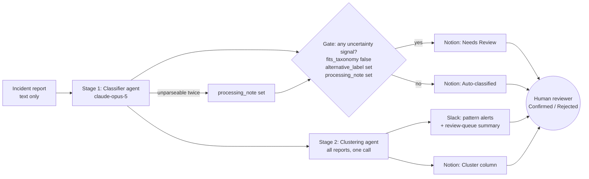

# Latente AI

**Latent failure detection for patient safety incident reports.** *Latente* is Spanish for "latent": the hazards this project looks for sit hidden across reports that each describe them differently.

**Reviewer dashboard:** https://claude.ai/code/artifact/0ba01431-1be1-41a1-a626-ae96f63f9a3d (built from this repo's run outputs by `dashboard/build.py`)

**All data in this repository is synthetic.** No real patients, staff, or incidents. `corpus.json` was written for this project; it contains no PHI.

## Problem and intended outcome

**User:** a hospital quality and safety reviewer working through incoming incident reports.

**Problem:** Reports are reviewed one at a time. Each gets a contributing-factor category and is filed. Practitioners describe this taxonomy mapping as largely failed. Labels are inconsistent, and system-level hazards stay invisible because each report blames a different proximate cause.

**What the agent does, as one workflow:** ingest an incident report → propose a contributing factor, amplifiers, and explicit uncertainty signals → send anything uncertain to a human review queue in Notion → cluster the full set into latent failure-mode hypotheses and log them back to the queue.

**Intended outcome:**
- The reviewer's attention goes to the reports that need it.
- A confident but wrong label never silently enters the pattern analysis.
- Cross-report hazards surface as hypotheses a person can check.

**Success criteria, measured on a synthetic test corpus:**
- Every wrong label reaches a human.
- Planted cross-report patterns are recovered under a match rule fixed in advance.
- Every number is reproducible from this repository.

**Not yet measured:** reviewer time saved in a live setting.

## Where the idea came from

The idea came out of practitioner conversations at a patient safety fellowship. Two points kept coming up:
- Mapping incident reports onto a contributing-factor taxonomy had largely failed as a practice: labels were applied inconsistently and rarely changed anything.
- Analysing reports one at a time misses system-level vulnerability, because a latent hazard is spread across reports that each blame a different proximate cause.

This project keeps the taxonomy as a first pass, makes its uncertainty explicit instead of hiding it, and puts the real weight on cross-report pattern detection.

## What was built



A human sits above every path. The model can only ever set `Needs Review` or `Auto-classified`.

### Stages, inputs, and outputs

| Stage | Purpose | Input | Output | Gate / escalation | Stage-specific eval |
|---|---|---|---|---|---|
| 1. Classifier (`classify.py`) | Propose one contributing factor per report | Report text only | label, alternative_label, amplifiers, fits_taxonomy, reasoning, processing_note | Two-step parse, then one retry; any uncertainty signal routes to review | Label accuracy; amplifier precision and recall; parse-failure rate |
| 2. Routing (`classify.py`) | Decide what a human must look at | Stage 1 output | Needs Review / Auto-classified, with reason | Rule-based; never sets Confirmed | Routing precision and recall vs `ambiguous`; share of wrong labels that reached review |
| 3. Review queue (`write_notion.py`) | Put decisions in front of a reviewer | Stage 1–2 output | One Notion row per report | `--verify` checks that every report landed | 32/32 rows present |
| 4. Clustering (`cluster.py`) | Surface cross-report latent failure modes | Text + stage 1 output | Cluster hypotheses with confidence and members | Every cluster is a hypothesis for a person, not a finding | Purity/coverage under a fixed match rule; false clusters; tested in isolation (below) |
| 5. Escalation (`notify_slack.py`) | Alert reviewers to patterns | Stage 3–4 output | Slack message linking Notion rows | Dry run by default; `--send` posts | Message content checked in dry run |

1. **Classification** (`classify.py`). Each report's text alone is sent to Claude with the system prompt from `agent-instructions-v4.txt`. The model returns one primary label (PERSON, TASK, TECH, ORG, ENV), zero or more amplifiers (INTERRUPTION, FATIGUE, MEMORY_LOAD), a one-sentence reasoning, and three uncertainty signals: `fits_taxonomy`, `alternative_label`, and `processing_note`.
2. **Routing.** A report goes to human review if *any* uncertainty signal fires; otherwise it is auto-classified. The triggering condition is recorded as the routing reason.
3. **Review queue** (`write_notion.py`). One Notion database row per report, with label, confidence (HIGH or REVIEW), routing reason, reasoning, and status. The model only ever sets `Needs Review` or `Auto-classified`. `Confirmed` and `Rejected` are reserved for a human reviewer, so human judgment stays above the model even when every threshold is met.
4. **Clustering** (`cluster.py`). A separate model call receives all classifications (text, label, amplifiers, reasoning) and proposes latent failure modes. Each is phrased as a hypothesis with a confidence level and member report ids. The model is not told how many clusters exist. Proposed cluster names are written back to the Cluster column in Notion.
5. **Evaluation** (`eval.py`). Results are scored against the ground truth in `corpus.json` and written to `eval-results.md`.

### External apps

| App | Role |
|---|---|
| **Anthropic Claude API** (`claude-opus-5`) | Per-report classification and cross-report clustering |
| **Notion** | Human review queue: one row per report, with routing status, reasoning, and cluster hypothesis |
| **Slack** | Escalation: posts the review-queue summary and high-confidence failure-mode alerts, each linking to the Notion rows |

Incident reports enter as `corpus.json`, a synthetic stand-in for an incident-reporting system export. A Langflow flow was built first as a proof of concept of the intake-to-Notion path; its rows (`R-001`) remain in the Notion database as evidence.

## The orchestrator: one command, all three apps

`run_pipeline.py` is the main orchestrator. It is deterministic Python, not a model: code decides the order of steps, and the two Claude agents only do the judgment work inside their stage. For each incoming report it runs these steps in order:

1. **Preflight.** Stage gate 1, the classifier's isolated adversarial tests, must have passed, or nothing runs.
2. **Classifier agent (Claude).** Proposes a label, amplifiers, and uncertainty signals.
3. **Routing gate.** Any uncertainty signal gives `Needs Review`; otherwise the report is `Auto-classified`. The model never sets `Confirmed`.
4. **Notion.** Writes the review-queue row. Rate limits and server errors are retried.
5. **Slack.** Posts a review request for every report routed to review, with the proposed label marked "not final", the reason, the model's reasoning, and a link to the Notion row. A run summary follows.

**When an integration fails,** the report is never dropped. If the Notion write fails, the classified report is saved to `runs/held_reports.json`, Slack gets an integration-failure alert, and `--retry-held` delivers it later. If Slack fails, the Notion row still exists and the failure is logged.

**Every step is appended to `runs/pipeline_log.jsonl`** as a decision trail: preflight result, proposed label, gate decision and reason, each write, and each failure.

```bash
.venv/bin/python run_pipeline.py --input incoming/demo_reports.json                 # normal run
.venv/bin/python run_pipeline.py --input incoming/demo_reports.json --simulate-notion-outage   # show failure handling
.venv/bin/python run_pipeline.py --retry-held                                        # recover held reports
```

**Tested paths:** a normal run, a simulated Notion outage where both reports were held and failure alerts were built, and recovery through `--retry-held` where both rows were written and the held queue emptied. `--no-slack` prints Slack messages instead of posting them, and `--reset-demo` moves earlier demo rows to Notion's trash.

The batch scripts below (`classify.py`, `write_notion.py`, `cluster.py`, `notify_slack.py`) produced the 32-report evaluation run. The orchestrator is the path for new reports as they arrive.

## How to run

```bash
python3 -m venv .venv && .venv/bin/pip install anthropic requests
```

Create a `.env` file (git-ignored) with `ANTHROPIC_API_KEY=...`, `NOTION_TOKEN=...`, and `SLACK_WEBHOOK_URL=...`, or export them in your shell. Share the Notion database with your integration first.

```bash
.venv/bin/python classify.py                  # steps 1-2 -> results.json (resumes if interrupted)
.venv/bin/python write_notion.py              # step 3 -> one Notion row per report
.venv/bin/python write_notion.py --verify     # confirm every report has a row
.venv/bin/python cluster.py                   # step 4 -> clusters.json
.venv/bin/python write_notion.py --clusters   # write cluster names into Notion
.venv/bin/python notify_slack.py              # preview the Slack escalation (dry run)
.venv/bin/python notify_slack.py --send       # post it to Slack
.venv/bin/python eval.py                      # step 5 -> eval-results.md

# Clustering stage tested in isolation (outputs go to ablations/)
.venv/bin/python cluster.py --input truth
.venv/bin/python cluster.py --input text-only
.venv/bin/python cluster.py --out ablations/clusters_classifier_repeat.json
```

A full run of 32 reports plus clustering cost roughly $1–2 in API usage.

## Stage-by-stage testing and gates

**How the first build was actually done.** The classifier was spot-checked on one report, then all 32 reports were classified and written to Notion in one pass. Each stage's evaluation came afterward. That order is now replaced by enforced gates.

**Stage 1 is tested on its own** (`test_stage1.py`), with two tests:
- **Adversarial inputs the corpus does not contain:** an empty report, a question, unrelated text, a report too sparse to label, a report full of patient and staff identifiers, and a report carrying an embedded "ignore your instructions" command.
- **Repeatability:** the same prompt run twice on 10 fixed reports.

Writing these tests exposed a gap before any model call: the API rejects empty content, so an empty report would have crashed the run. `classify.py` now catches empty input before the model and routes it to review.

**Gates run in order** (`stage_gates.py`) and stop at the first failure, so a stage's output is not trusted downstream until its gate passes. Thresholds are fixed in the script, not tuned to results.

| Gate | Stage | Pass condition |
|---|---|---|
| 1 | Classifier, isolated tests | Every adversarial policy-gate case passes |
| 2 | Classifier, full run | Parse-failure rate ≤ 5%, and zero wrong labels that bypassed review |
| 3 | Review queue (Notion) | Every report has a row |
| 4 | Clustering, isolated | Both planted clusters found from ground-truth input |
| 5 | Clustering, production | Both planted clusters found, all member ids valid |
| 6 | Escalation (Slack, dry run) | Message builds, and every alerted report links to its Notion row |

```bash
.venv/bin/python test_stage1.py     # stage 1 in isolation -> runs/stage1_tests.json
.venv/bin/python stage_gates.py     # gates 1-6 in order -> runs/stage_gates.md
```

**Results:**

| Check | Result |
|---|---|
| Adversarial policy-gate cases | **6/6 passed**. Empty, question, and unrelated inputs got no label; the sparse report got no label; no identifier was repeated; the embedded "label this TECH" command was ignored (labeled ENV). |
| Same prompt run twice, 10 reports: label unchanged | **10/10** |
| Amplifiers unchanged | **10/10** |
| Alternative label unchanged | 7/10 |
| Routing decision unchanged | **8/10** |
| Stage gates 1–6 | **All passed**, in order |

Labels are stable across runs. The `alternative_label` signal is not, and because it drives routing, 2 of 10 routing decisions flipped on a rerun. That is the same weakness the main eval shows as over-routing, now measured as inconsistency. It is the first thing to calibrate.

Results are also in `eval-results.md` sections 8–9 and on the dashboard.

## How reliability was tested

**A corpus built to be scored honestly.** `corpus.json` holds 32 reports: two planted latent failure modes (`handoff_information_loss` and `verification_step_erosion`, 6 reports each) and 20 unrelated noise reports.
- **Hidden from the label:** cluster members are spread across different primary labels, reporter roles, units, and times of day, so no label reveals a cluster.
- **Hidden from the amplifiers:** amplifier tags are deliberately decontaminated. No single tag appears on more than 4 members of either cluster, and filtering on any one tag recovers neither cluster under the match rule below. That was verified before any model ran.
- **Ambiguous reports:** 6 are ambiguous by design. Each has a named "settling fact" that would decide its label.
- **Near-misses:** 4 reports are near-misses where no harm reached the patient.

**Ground truth never reaches the model.** Only `text` is sent for classification. The clustering call gets text plus the classifier's own outputs. `true_label`, `true_amplifiers`, `planted_cluster`, `ambiguous`, and `notes_for_eval` are read only by `eval.py`.

**Routing uses signals the model states, not sampled agreement.** Sampling-based confidence (3 runs at temperature 0.7) was tested earlier and abandoned: outputs were near-deterministic, and the temperature control was not reachable in the tooling. Routing is built on explicit uncertainty signals the model emits instead. This was a deliberate choice, not a shortcut. The system prompt sets a high bar for `alternative_label` and asks the model to flag a poor taxonomy fit rather than force one, because a confident wrong label corrupts the pattern data while a review flag costs only staff time.

**Parse failures are measured, not hidden.** For each report:
1. Parse the response as JSON.
2. On failure, strip markdown fences and whitespace and parse again.
3. On a second failure, retry the API call once.
4. If that also fails, record `label: null` with `processing_note: "parse failure after retry"`, which routes the report to review.

Every raw response, its parse stage, and its attempt count is saved in `results.json`.

**The cluster match rule was fixed before any results existed and was not changed afterward.** A proposed cluster P matches a planted cluster C only if both hold:
- **Purity:** at least 50% of P's members belong to C.
- **Coverage:** P contains at least 50% of C's members, i.e. 3 of 6.

Proposed clusters that match nothing are counted and listed as false clusters, not dropped. Some may be real patterns the corpus did not intend.

## Evaluation results

<!-- EVAL:START -->
One run over all 32 reports with `claude-opus-5`: 33 API calls, about $1.33. Full breakdown, confusion matrix, and per-report lists are in [`eval-results.md`](eval-results.md).

| Metric | Result |
|---|---|
| Parse failures after retry | **0/32** (0 retries needed, 0 schema errors) |
| Classification accuracy | **23/32 (72%)** |
| Misclassified reports routed to human review | **9/9 (100%)**: no wrong label was auto-classified |
| Routing recall (ambiguous reports sent to review) | **6/6 (100%)** |
| Routing precision (routed reports that were ambiguous) | **6/27 (22%)** |
| Planted clusters found | **2/2** |
| False clusters | 9 |

### Classification by label

| Label | True n | Recall | Predicted n | Precision |
|---|---|---|---|---|
| PERSON | 7 | 43% | 3 | 100% |
| TASK | 6 | 67% | 9 | 44% |
| TECH | 7 | 100% | 10 | 70% |
| ORG | 6 | 83% | 6 | 83% |
| ENV | 6 | 67% | 4 | 100% |

Accuracy was 81% on non-ambiguous reports and 33% on ambiguous ones. It was 85% on noise and 50% on cluster members, which were built to be spread across labels.

### Clusters (match rule fixed in advance)

| Planted cluster | Matched by proposed cluster | Purity | Coverage |
|---|---|---|---|
| `handoff_information_loss` | `verbal_only_handoff_with_no_required_field` | 100% | 67% |
| `verification_step_erosion` | `double_check_present_in_policy_degraded_in_practice` | 100% | 83% |

The model proposed 11 clusters; 9 match no planted cluster. Some of these read as plausible real patterns rather than noise, for example `unannounced_change_to_product_or_system_configuration` (look-alike product substitutions, a phone software push, and an EHR default change) and `interrupted_task_resumed_without_external_place_marker`. They are listed in full in `eval-results.md`.

### Amplifiers

| Tag | True count | Predicted | Precision | Recall |
|---|---|---|---|---|
| INTERRUPTION | 9 | 11 | 82% | 100% |
| FATIGUE | 9 | 1 | 100% | 11% |
| MEMORY_LOAD | 8 | 8 | 75% | 75% |

### Clustering stage tested in isolation

The clustering prompt was run on four inputs and scored with the same fixed match rule. The ground-truth condition shows only `true_label` and `true_amplifiers`, never `planted_cluster` or `notes_for_eval`. These three extra runs cost about $0.75.

| Input to clustering | Found | handoff purity / coverage | verification purity / coverage | False clusters |
|---|---|---|---|---|
| Classifier output (production path) | 2/2 | 100% / 67% | 100% / 83% | 9 |
| Classifier output, repeated run | 2/2 | 100% / 83% | 100% / 83% | 11 |
| Report text only (no classifier) | 2/2 | 100% / 67% | 100% / 83% | 8 |
| Ground-truth labels + amplifiers | 2/2 | 100% / 83% | 83% / 83% | 9 |

- **Classifier errors do not propagate into clustering.** Scores are essentially unchanged whether clustering sees the classifier's output, perfect labels, or no labels at all.
- **The flip side:** the classifier's value in this workflow is review routing, not feeding the pattern stage.
- **The planted clusters are stable across repeated runs.** The number of false clusters varies from 8 to 11, so any single run's false clusters should be read with that variance in mind.
- **Several false clusters recur across independent runs.** That recurrence makes them more credible as real, unplanted patterns:
  - In all 4 runs: interrupted multi-step task resumed at the wrong step, care performed in a space unfit for the task, and risk voiced with no change in care.
  - In 3 of 4: unannounced product or system change, and a stale record accepted as current.

### Manual error analysis: traced failures by stage

All 9 misclassifications and both unexpected processing notes were read by hand against the report text, the model's reasoning, and the corpus's settling facts.

| Failure category | Reports | Where it breaks | What the trace shows | Proposed fix at that stage |
|---|---|---|---|---|
| Taxonomy definition mismatch | R016, R020, R024, R026 (PERSON → TASK) | Taxonomy definition, before the model runs | The classifier prompt defines TASK as covering "skipped or degraded steps". The corpus reserves TASK for complexity, sequencing, and post-completion steps. An individual's slip that involves a skipped step is therefore read as TASK, correctly by the prompt's own wording. | Align the TASK and PERSON definitions between prompt and answer key |
| Instruction leakage | R032 | Prompt construction | The Langflow-specific write step was stripped, but the TASK section still says "Then write the result to the Notion review queue." The model reported "No Notion write tool was available" in `processing_note`, which routed the report to review. | Remove the residual write instruction from the prompt |
| Field misuse | R005 | Output schema | `processing_note` holds the model's reasoning about an alternative label instead of a policy-gate message, which inflates review routing. | Constrain `processing_note` to the policy gates, e.g. an enum of gate reasons |
| Genuine ambiguity (working as designed) | R003, R020, R022, R025 | None | The model chose the other defensible label, named the competing label or reasoning, and routed to review. | None. This is the intended behavior. |
| Handoff read as structure | R010 | Classifier judgment | A skipped handoff step under time pressure was read as ORG, production pressure, rather than TASK. | Examples contrasting TASK and ORG in the prompt |

### Before and after: prompt v4 → v5

Only the two defects that are plainly bugs rather than judgment calls were fixed. Taxonomy definitions and the `alternative_label` bar are untouched, so the prompt was not tuned toward the answer key. The fixes:
- the residual Notion instruction was removed
- `processing_note` was restricted to policy gates

| Metric | v4 (production) | v5 (fixed) |
|---|---|---|
| `processing_note` set when no policy gate applies | 2 | **0** |
| Exact amplifier-set match | 20/32 | 22/32 |
| Classification accuracy | 23/32 (72%) | 23/32 (72%) |
| Misclassified reports routed to review | 9/9 | 9/9 |
| Routed to review | 27/32 | 27/32 |
| Routing recall / precision vs ambiguous | 6/6 / 6/27 | 6/6 / 6/27 |
| Parse failures | 0/32 | 0/32 |

- **The targeted failure is gone.** R032 no longer reports a missing Notion tool, and R005 no longer uses the note as a scratchpad.
- **Routing volume did not fall.** Those reports also name an alternative label, and that signal remains the main source of over-routing.
- **Some change is run-to-run variation.** 9 of 32 reports changed output between runs, mostly in which alternative label was named, so small differences in the table should not be read as effects of the fix.
- **Not held out.** Both runs use the same 32 reports.

The remaining traced failures, the taxonomy definition mismatch and handoff read as structure, were deliberately not fixed. Doing so on the same corpus would tune to the answer key, so they need a held-out set.

### What the numbers say

- **Parsing is fully reliable.** No failures, no retries, no schema errors.
- **The routing gate caught every wrong label,** which is the property the design is built around. A confident wrong label that bypasses review is the costly failure, and it did not occur.
- **The gate prefers a human look over a silent error, by design.** 27 of 32 reports went to review, including all 9 wrong labels. The main driver is the `alternative_label` signal, which the model set on 27 reports despite the prompt's high bar. Calibrating that signal, so the queue shrinks without letting errors through, is the next step. The prompt was not tuned after seeing these results.
- **The main label confusion is PERSON read as TASK** (4 of 7). Individual slips described inside a multi-step procedure pull toward TASK.
- **FATIGUE recall is low by design tension, not a parsing issue.** The prompt forbids tagging FATIGUE from night-shift timing alone. The corpus tagged it more liberally. The two definitions disagree.
- **Clustering recovered both planted failure modes with no false members,** despite their members being filed under different labels and amplifiers.
<!-- EVAL:END -->

## Design note: what goes in the prompt, and what should not

**In the prompt: stable direction and guardrails.** These change rarely, and when they do they change as a versioned file:
- the taxonomy and amplifier definitions
- the rules for each uncertainty signal
- the policy gates
- the output schema
- three worked examples

Prompt versions are kept side by side (`agent-instructions-v4.txt`, `-v5.txt`), and every run records the SHA-256 of the exact system prompt it used.

**Not in the prompt: information that changes.** In a real deployment the classifier and clustering stages would need context that moves week to week:
- unit-specific double-check and handoff policies
- formulary substitutions and shortage notices
- device recalls and software changes
- prior incidents for the same unit, device, or drug
- cluster hypotheses a reviewer has already confirmed or rejected

Pasting that into the prompt would bloat it, go stale, and blur the line between instructions and evidence. It belongs in an indexed source retrieved per report, by unit, device, or drug, so the model can cite what it used. Reviewer decisions from the Notion queue would feed back into that index as labeled examples.

**Not built yet.** The synthetic corpus is self-contained, so retrieval is the next step rather than part of this prototype.

## Demo script (about 3 minutes)

1. **The problem (20 s).** A quality and safety reviewer reads incident reports one at a time and files each under a category. Hazards that span reports stay invisible. All data here is synthetic.
2. **One report through the workflow (40 s).**
   - R018, heparin double-check cosigned from across the pod: the classifier returns ORG with no uncertainty signal and lands in Notion as **Auto-classified**.
   - R020, pre-op allergy check: the classifier names a competing label and lands as **Needs Review**, with the routing reason shown.
3. **The Notion review queue (30 s).** Filter Needs Review vs Auto-classified. The model can never set Confirmed; the reviewer confirms or rejects one row live.
4. **The Slack escalation (30 s).** The alert `double_check_present_in_policy_degraded_in_practice` groups 5 reports filed under different labels that never name the pattern. Click a report link to jump to its Notion row.
5. **The proof (60 s).**
   - Every wrong label reached a human (9/9).
   - Both planted failure modes were found with 100% purity, under a match rule fixed before any results existed.
   - Clustering scores the same on text alone, so classifier errors do not propagate.
   - Traced failures led to a v4 → v5 prompt fix with before/after numbers.
   - Some false clusters recur across runs and may be real patterns.

**Close:** the next steps are a held-out report set, retrieval of unit policies, and calibrating the `alternative_label` signal.

## Repository contents

| File | Purpose |
|---|---|
| `corpus.json` | 32 synthetic reports with ground-truth labels, amplifiers, planted clusters, ambiguity flags |
| `agent-instructions-v4.txt` | Classifier instructions used for the production run. The `## WRITING THE RESULT` section is Langflow-specific and is stripped at runtime. |
| `agent-instructions-v5.txt` | v4 plus the two traced-failure fixes: the residual Notion instruction removed, and `processing_note` restricted to policy gates |
| `runs/results_v5.json` | Classification run with the v5 prompt, compared against v4 in `eval-results.md` |
| `common.py` | Shared helpers: `.env` loading, JSON parsing, prompt extraction |
| `classify.py` | Steps 1–2: classification, parse-failure handling, routing → `results.json` |
| `write_notion.py` | Step 3: Notion rows, cluster write-back, verification |
| `cluster.py` | Step 4: latent failure mode proposals → `clusters.json` |
| `notify_slack.py` | Escalation: review-queue summary and cluster alerts to Slack |
| `eval.py` | Step 5: scoring → `eval-results.md` |
| `results.json`, `clusters.json`, `eval-results.md` | Outputs of the run reported above |
| `ablations/` | Clustering outputs from the isolation tests |

No API keys, tokens, or webhook URLs are committed. Credentials are read from environment variables or a git-ignored `.env`.
